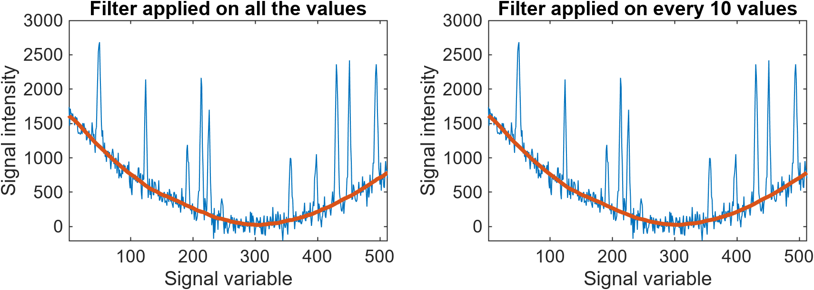
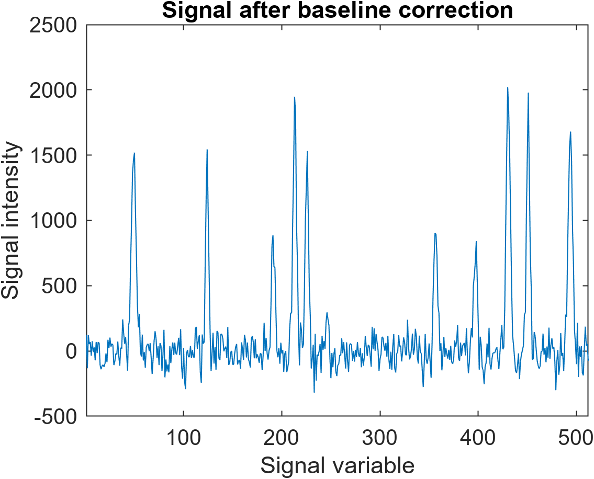
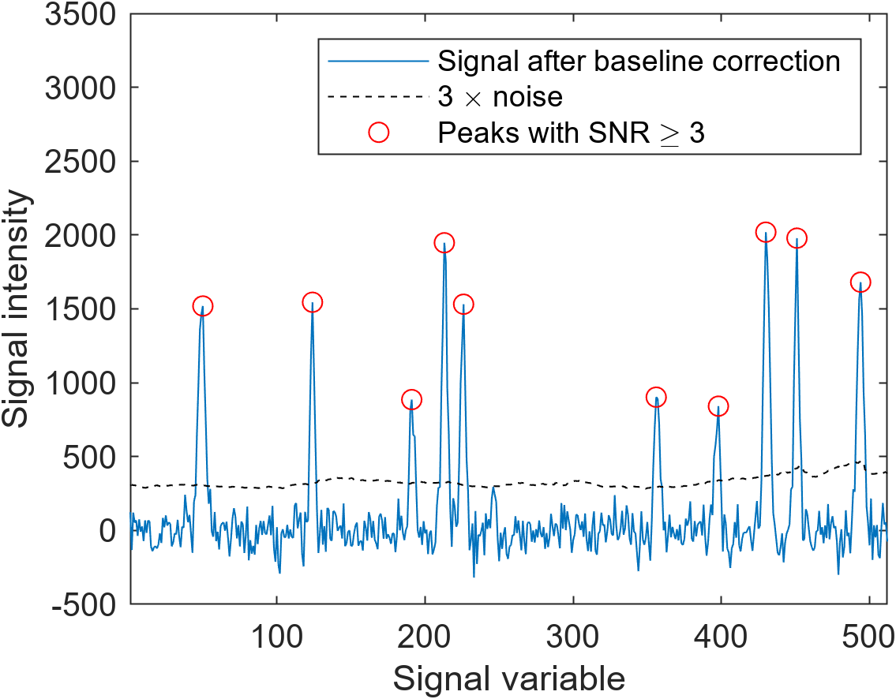
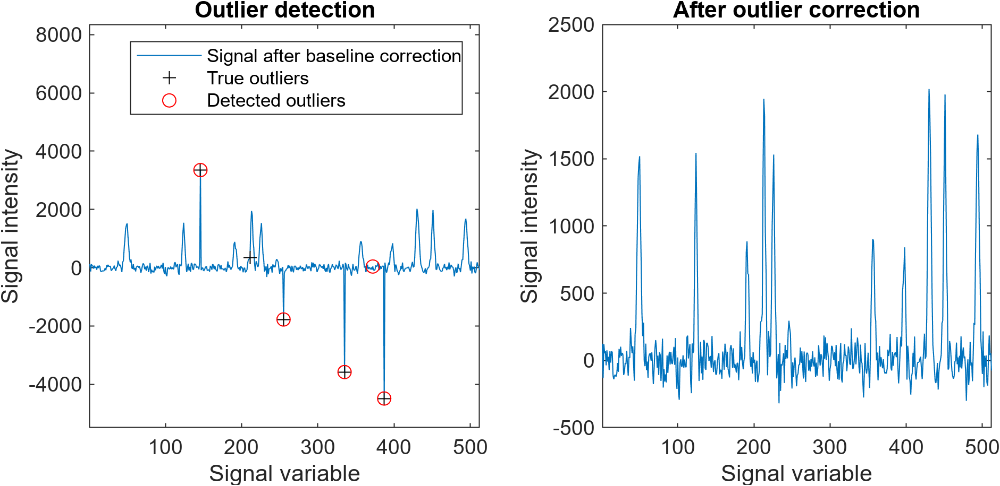

# sgolay_robust examples

The present documents shows a few examples on the use of `sgolay_robust` in MATLAB.

## Data generation

A synthetic noisy signal with non constant baseline and gaussian peaks can be generated as follows:

    nb_val = 512 ; % number of values in the signal
    noise = 100 ; % noise value
    
    x = [1:nb_val]' ; % x_coordinates vector
    
    % Generation of the baseline
    true_baseline = 100*(rand-0.5)+0.1*(rand-0.5)*x ...
        +0.05*(rand-0.5)*(x-numel(x)*rand).^2 ...
        +rand*1000*cos(0.001*rand*x+2*pi*rand) ;
    
    % Noise addition
    y = true_baseline + noise*randn(size(x)) ;
    
    % Peak addition
    N_peaks = round(0.05*nb_val*rand) ;
    h = 5*std(y)*rand(1,N_peaks) ;
    s = 2+rand(1,N_peaks)-0.5 ;
    mu = nb_val*rand(1,N_peaks) ;
    y = y + sum(h.*exp(-1/2.*((x-mu)./s).^2),2) ;
    
    % Signal representation
    figure("Position",[100 100 400 300]) ;
    plot(y) ;
    xlim([1 nb_val]) ;
    xlabel("Signal variable") ;
    ylabel("Signal intensity") ;

The code can generate outputs like the following one:

## Baseline correction

To perform baseline correction, a filter with a frame much larger than peak width should be applied. 

    tic ; [y0,s] = sgolay_robust(y,100,2,1) ; toc
    
`Elapsed time is 0.062666 seconds.`

To gain time on calculations, it is possible to apply the filter on every 10 values:

    tic ; [y0_int,s_int] = sgolay_robust(y,100,2,10,"Interpolation","makima") ; toc
    
`Elapsed time is 0.005056 seconds.`

The results can be compared in a subplot layout:

    figure("Position",[100 100 640 200]) ;
    subplot(1,2,1) ;
    plot(y) ; hold on ;
    plot(y0,"LineWidth",2) ; hold off ;
    xlim([1 nb_val]) ;
    xlabel("Signal variable") ;
    ylabel("Signal intensity") ;
    title(["Filter applied on all the values"]) ;
    subplot(1,2,2) ;
    plot(y) ; hold on ;
    plot(y0_int,"LineWidth",2) ; hold off ;
    xlim([1 nb_val]) ;
    xlabel("Signal variable") ;
    ylabel("Signal intensity") ;
    title(["Filter applied on every 10 values"]) ;

Skipping 90% of the data during the filtering permitted to divide the calculation time by roughly 10, whithout significant loss of precision.

Then it is possible to represent the signal after baseline correction:

    figure("Position",[100 100 400 300]) ;
    plot(y-y0) ;
    xlim([1 nb_val]) ;
    xlabel("Signal variable") ;
    ylabel("Signal intensity") ;
    title("Signal after baseline correction") ;

## Peak detection

Thanks to the second output, it is possible to locate peaks with a signal to noise ratio larger than 3:

    SNR = (y-y0)./s ;
    tf = islocalmax(y-y0) & SNR >= 3 ;
    figure("Position",[100 100 400 300]) ;
    plot(y-y0,"DisplayName","Signal after baseline correction") ; hold on ;
    plot(3*s,"k--","DisplayName","3 \times noise") ; 
    plot(x(tf),y(tf)-y0(tf),"ro","DisplayName","Peaks with SNR \geq 3") ; hold off ;
    legend ;
    xlabel("Signal variable") ;
    ylabel("Signal intensity") ;
    xlim([1 nb_val]) ;
    ylim([-500 3500]) ;

## Outlier detection and correction

Using a narrow frame, the filter can also be used for outlier detection and correction.

First, we generate outliers in the signal:

    % Indexing 5 outliers
    idx = randperm(nb_val) ;
    idx = idx(1:5) ;
    % Generating outliers
    y(idx) = 10000*(rand(size(idx))-0.5) ;

Then, the signal is smoothed with a narrow frame.

    % Signal smoothing using a narrow frame length
    [y_smoothed,s] = sgolay_robust(y,5,2,1) ;

By thresholding, outliers can be detected and corrected:
    
    % Testing outliers
    tf = abs(y_smoothed-y) >= 10*s ;
    
    % Outlier correction
    y_corrected = y ;
    y_corrected(tf) = y_smoothed(tf) ;

The procedure produces the following results:

    figure("Position",[100 100 700 300]) ;
    subplot(1,2,1) ;
    plot(y-y0,"DisplayName","Signal after baseline correction") ; 
    xlabel("Signal variable") ;
    ylabel("Signal intensity") ;
    xlim([1 nb_val]) ;
    ylim([min(y-y0)-1000 max(y-y0)+5000]) ;
    hold on ;
    plot(x(idx),y(idx)-y0(idx),"k+","DisplayName","True outliers") ; 
    plot(x(tf),y(tf)-y0(tf),"ro","DisplayName","Detected outliers") ; 
    hold off ;
    legend ;
    title("Outlier detection") ;
    subplot(1,2,2) ;
    
    plot(y_corrected-y0) ; 
    xlabel("Signal variable") ;
    ylabel("Signal intensity") ;
    title("After outlier correction") ;
    xlim([1 nb_val]) ;

