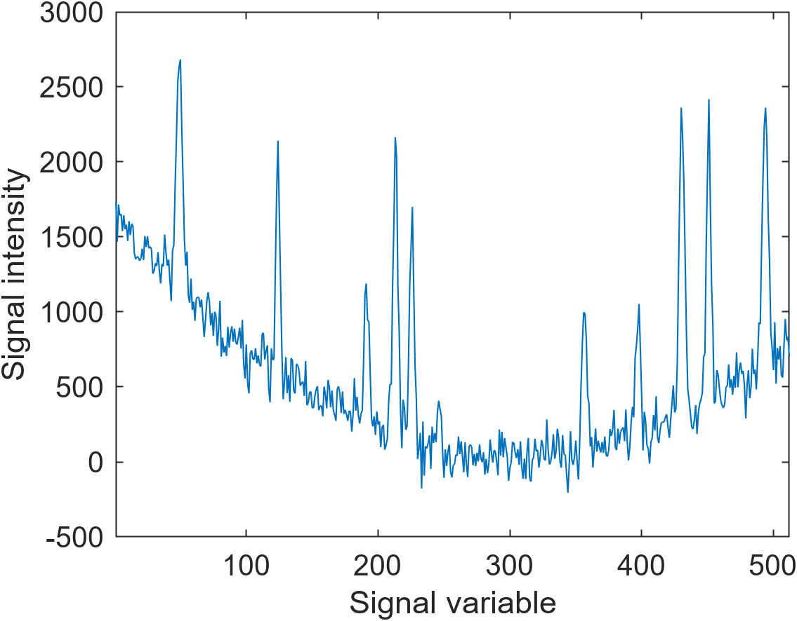

# sgolay_robust examples

The present documents shows a few examples on the use of `sgolay_robust` in MATLAB.

## Data generation

A synthetic noisy signal with non constant baseline and gaussian peaks can be generated as follows:

    nb_val = 512 ; % number of values in the signal
    noise = 100 ; % noise value
    
    x = [1:nb_val]' ; % x_coordinates vector
    
    % Generation of the baseline
    true_baseline = 100*(rand-0.5)+0.1*(rand-0.5)*x ...
        +0.05*(rand-0.5)*(x-numel(x)*rand).^2 ...
        +rand*1000*cos(0.001*rand*x+2*pi*rand) ;
    
    % Noise addition
    y = true_baseline + noise*randn(size(x)) ;
    
    % Peak addition
    N_peaks = round(0.05*nb_val*rand) ;
    h = 5*std(y)*rand(1,N_peaks) ;
    s = 2+rand(1,N_peaks)-0.5 ;
    mu = nb_val*rand(1,N_peaks) ;
    y = y + sum(h.*exp(-1/2.*((x-mu)./s).^2),2) ;
    
    % Signal representation
    figure("Position",[100 100 400 300]) ;
    plot(y) ;
    xlim([1 nb_val]) ;
    xlabel("Signal variable") ;
    ylabel("Signal intensity") ;

The code produces the following output:

